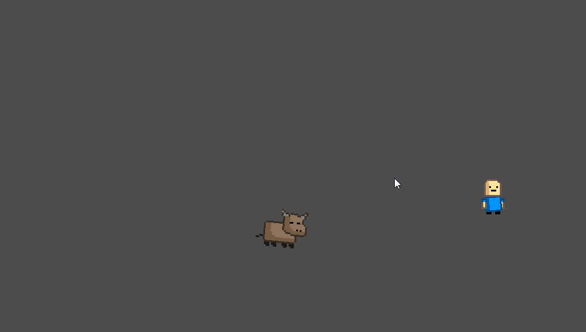

# Description

This project is a demo of a charging enemy character in Godot. It showcases a 2D actor (a bull) that chases the player character, while preserving its momentum should the player suddenly change course. To prevent the 2D actor from endlessly orbitting around the player character, a simple braking mechanic is applied whenever the actor makes sudden turns. This allows the actor to slow down and eventually touch the player character.

Expect this project to be expanded upon in the future and the high likely-hood of a game coming into fruition from this basic demo.